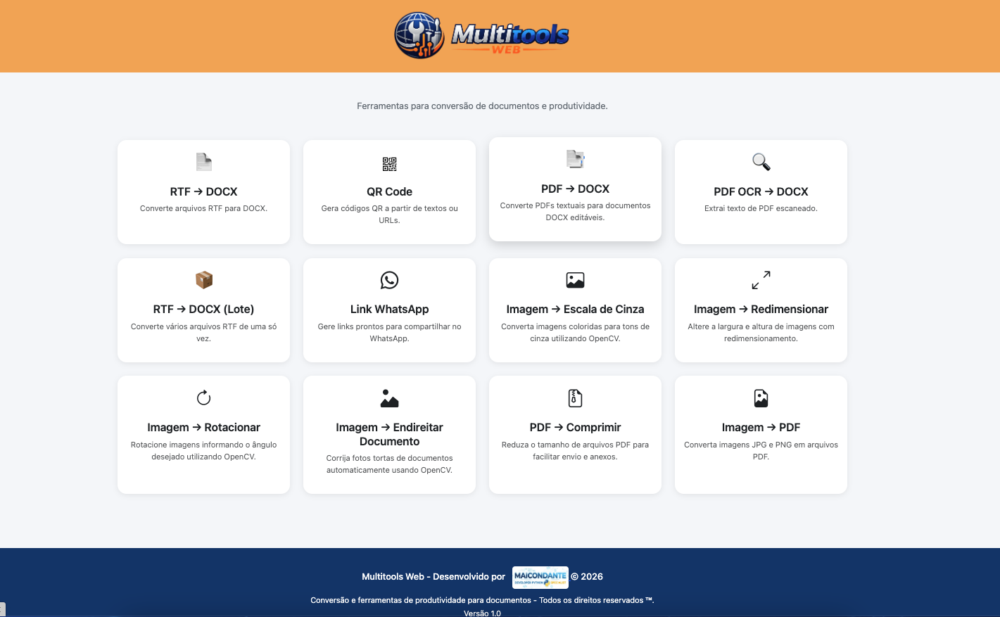

# Multitools Web

Aplicação web desenvolvida em Python e Flask para conversão de documentos e ferramentas de produtividade.

## Objetivo

O projeto nasceu da necessidade de converter arquivos RTF para DOCX de forma simples e eficiente, permitindo compatibilidade com Microsoft Word Online e outras plataformas modernas.

A proposta é criar uma central de ferramentas úteis para documentos e produtividade, expandindo gradualmente com novas funcionalidades.

---



---

## Funcionalidades Implementadas

### Conversão de Documentos

* Conversão de RTF para DOCX
* Conversão em lote de RTF para DOCX
* Geração automática de arquivo ZIP para downloads em lote

### Interface

* Layout responsivo com Bootstrap
* Navbar personalizada
* Identidade visual própria
* Favicon personalizado
* Página para funcionalidades em desenvolvimento

### Estrutura

* Arquitetura modular utilizando Flask
* Separação entre rotas, serviços, templates e arquivos estáticos
* Limpeza automática de arquivos temporários antes das conversões

---

## Funcionalidades Planejadas

* PDF para DOCX
* PDF OCR para DOCX
* Extração de texto de imagens
* Geração de QR Code
* Encurtador de URL
* Gerador de link para WhatsApp
* Outras ferramentas de produtividade

---

## Tecnologias Utilizadas

* Python 3
* Flask
* Bootstrap 5
* python-docx
* Gunicorn

---

## Estrutura do Projeto

```text
multitools_web/
│
├── app/
│   ├── services/
│   ├── static/
│   │   ├── css/
│   │   └── images/
│   ├── templates/
│   ├── routes.py
│   └── __init__.py
│
├── uploads/
├── outputs/
│
├── run.py
├── requirements.txt
├── render.yaml
└── README.md
```

---

## Instalação

Clone o repositório:

```bash
git clone https://github.com/MaiconDante/multitools_web.git
```

Acesse a pasta:

```bash
cd multitools_web
```

Crie e ative o ambiente virtual:

### Windows

```bash
python -m venv venv

venv\Scripts\activate
```

### Linux

```bash
python3 -m venv venv

source venv/bin/activate
```

Instale as dependências:

```bash
pip install -r requirements.txt
```

---

## Execução Local

```bash
python run.py
```

Acesse:

```text
http://127.0.0.1:5000
```

---

## Deploy

A aplicação está preparada para deploy no Render utilizando Gunicorn.

---

## Versionamento

O projeto utiliza Conventional Commits para organização do histórico de desenvolvimento.

Exemplos:

```text
feat: adicionar conversao em lote
style: aprimorar identidade visual
refactor: reorganizar estrutura dos templates
chore: preparar aplicacao para deploy
```

---

## Licença

Projeto desenvolvido para fins de estudo, aprendizado e utilização profissional.
